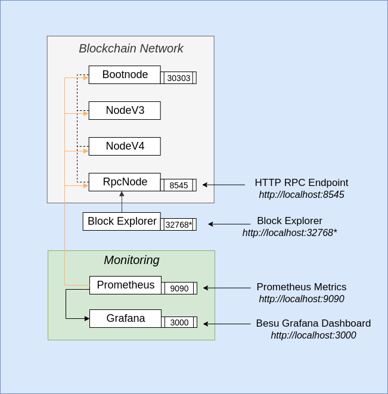
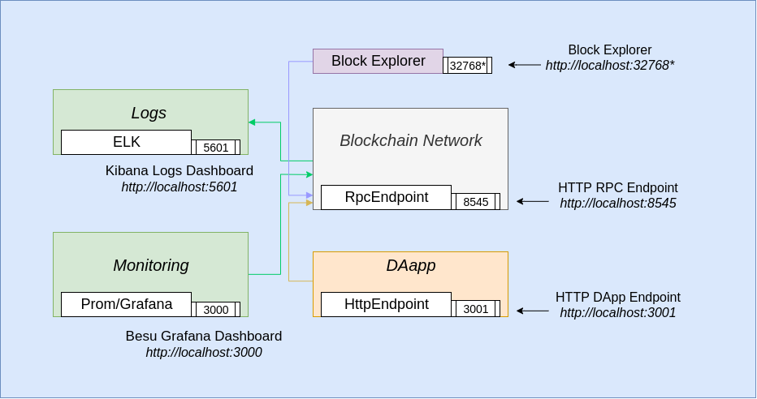
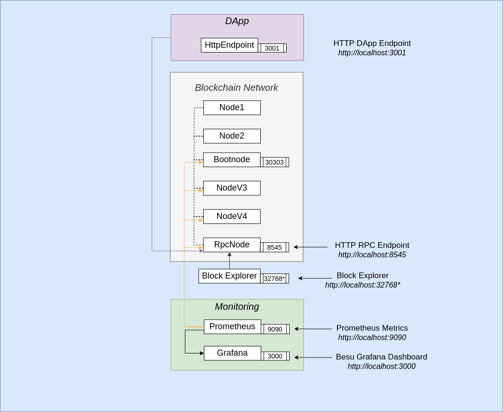
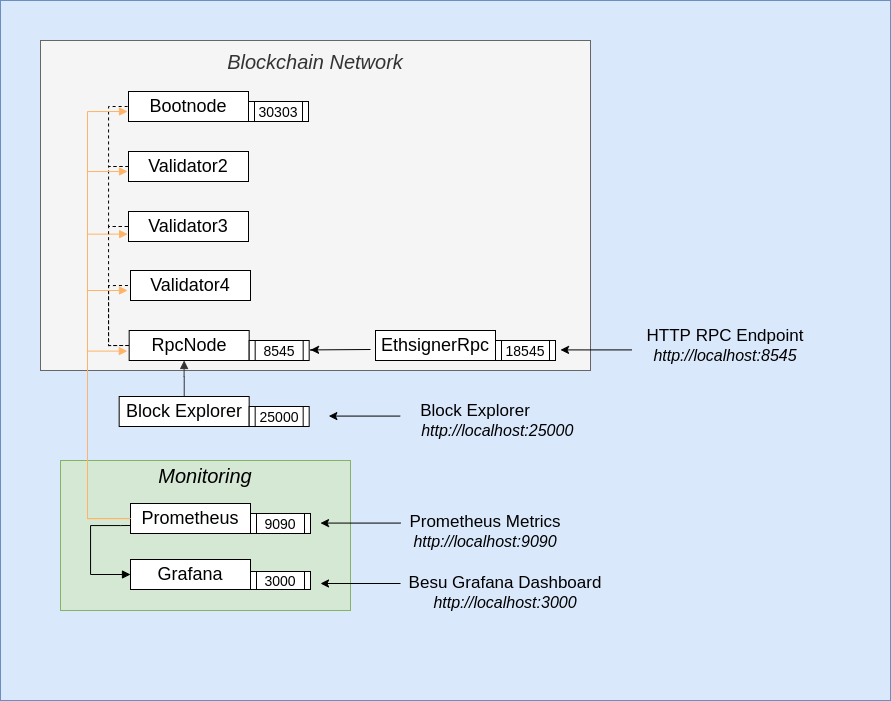

# Besu Sample Networks

## Table of Contents
1. [Prerequisites](#prerequisites)
2. [Example Network Setups](#example-network-setups)
    1. [POW (ethash) Network](#pow-network)
    2. [POA (IBFT2) Network](#poa-network)
    3. [Smart Contracts & DApp](#smart-contract-dapp)
    4. [POA (IBFT2) Network with ELK for centralised logs](#poa-network-logs)
    5. [POA (IBFT2) Network with Privacy via Orion](#poa-network-privacy)
    6. [POA (IBFT2) Network with On Chain Permissioning](#poa-network-permissioning)
    7. [POA (IBFT2) Network with Ethsigner](#poa-network-ethsigner)

## Prerequisites

To run these tutorials, you must have the following installed:

- [Docker and Docker-compose](https://docs.docker.com/compose/install/)

| ⚠️ **Note**: If on MacOS or Windows, please ensure that you allow docker to use upto 4G of memory or 6G if running Privacy examples under the _Resources_ section. The [Docker for Mac](https://docs.docker.com/docker-for-mac/) and [Docker Desktop](https://docs.docker.com/docker-for-windows/) sites have details on how to do this at the "Resources" heading       |
| ---                                                                                                                                                                                                                                                                                                                                                                                |

| ⚠️ **Note**: This has only been tested on Windows 10 Build 18362 and Docker >= 17.12.2                                                                                                                                                                                                                                                                                              |
| ---                                                                                                                                                                                                                                                                                                                                                                                |

- On Windows ensure that the drive that this repo is cloned onto is a "Shared Drive" with Docker Desktop
- On Windows we recommend running all commands from GitBash
- [Nodejs](https://nodejs.org/en/download/) and [Truffle](https://www.trufflesuite.com/truffle) if using the DApp

## Example Network Setups
All our documentation can be found on the [Besu documentation site](https://besu.hyperledger.org/Tutorials/Examples/Private-Network-Example/).

There are multiple examples in this repo, and each has a Proof of Work(POW) and Proof of Authority(POA) setup. Each setup 
comprises a minimum of 4 Ethereum nodes with monitoring tools like:
- [Alethio Lite Explorer](https://besu.hyperledger.org/en/stable/HowTo/Deploy/Lite-Block-Explorer/) to explore blockchain data at the block, transaction, and account level
- [Metrics monitoring](https://besu.hyperledger.org/en/stable/HowTo/Monitor/Metrics/) via prometheus and grafana to give you insights into how the chain is progressing
- Optional [logs monitoring](https://besu.hyperledger.org/en/latest/HowTo/Monitor/Elastic-Stack/) to give you real time logs of the nodes. This feature is enabled with a `-e` flag when starting the sample network

The examples also include architecture diagrams to visually show components. They generally use the POA (IBFT2 algorithm) setup, and to view the architecture diagrams for the POW (ethash) setup please see the `images` folder (where the POA variants have different suffixes). 

Each section also includes use case personas (intended as guidelines only).
 
**To start services and the network:**

`./run.sh` starts all the docker containers in POW mode

`./run.sh -c ibft2` starts all the docker containers in POA mode using the IBFT2 Consensus algorithm

There is an optional `-e` parameter which provides centralised logging functionality via ELK 

**To stop services :**

`./stop.sh` stops the entire network, and you can resume where it left off with `./resume.sh` 

`./remove.sh ` will first stop and then remove all containers and images

### i. POW (ethash) Network  

This is the closest thing to how 'BitCoin' works, where miners create blocks. In the Ethereum space, the 'mainnet' and 'ropsten' public networks are POW based
 

Start the network with: 

`./run.sh ` 

Use cases: 
 - you are learning about how Ethereum works 
 - you are looking to create a Mainnet or Ropsten node but want to see how it works on a smaller scale
 - you are a DApp Developer looking for a robust, simple network to use as an experimental testing ground for POCs. 
 Generally speaking DApp developers prefer the immediate finality that a POA IBFT2 algorithm offer but POW networks work wells too
 
### ii. POA (ethash) Network  
 

Start the network with: 

`./run.sh -c ibft2` 

Use cases: 
 - you are learning about how Ethereum works 
 - you are looking to create a private eth network
 - you are a DApp Developer looking for a robust, simple network to use as an experimental testing ground for POCs. With the IBFT2 protocol you get immediate finality which makes life easier

### iii. Smart Contracts & DApp (with MetaMask) 

- Install [metamask](https://metamask.io/) as an extension in your browser
- Once you have setup your own private account, select 'My Accounts' by clicking on the avatar pic and then 'Import Account' and enter the following private_key: `0xc87509a1c067bbde78beb793e6fa76530b6382a4c0241e5e4a9ec0a0f44dc0d3`
- Run `./run-dapp.sh` and when that completes open a new tab in your browser and go to `http://localhost:3001` which opens the Truffle pet-shop box app and you can adopt a pet from there.
NOTE: Once you have adopted a pet, you can also go to the block explorer and search for the transaction where you can see its details recorded. Metamask will also have a record of any transactions.

This is a [video tutorial](https://www.youtube.com/watch?v=_3E9FRJldj8) of the DApp example

Behind the scenes, this has used a smart contract that is compiled and then deployed (via a migration) to our test network. The source code for the smart contract and the DApp can be found in the folder `pet-shop`

### iv. [POA (IBFT2) Network with ELK for centralised logs] 

This is the same as example ii. [POA (IBFT2) Network](#poa-network) but adds in centralized logging via ELK 

Start the network with: 

`./run.sh -c ibft2 -e` 

Use cases: 
 - you are learning about how Ethereum works 
 - you are looking to create a private Ethereum network
 - you are a DevOps engineer or administrator looking to see how the full blockchain works with logging and metrics
 - you are a DApp developer and looking to build on the previous example with the ability to see transaction logs via ELK 

### v. POA (IBFT2) Network with Privacy via Orion 

Start the network with: 
`./run-privacy.sh -c ibft2 -e` starts all the docker containers in POA mode using the IBFT2 Consensus algorithm, and also has 3 Orion nodes for privacy 

`./run-privacy.sh` starts all the docker containers in POW mode, and also has 3 Orion nodes for privacy 

Use cases: 
 - you are learning about how Ethereum works 
 - you are a user looking to execute private transactions at least one other party
 - you are looking to create a private Ethereum network with private transactions between two or more parties. The logs make it easy to see whats going on between nodes and transactions

This is a [video tutorial](https://www.youtube.com/watch?v=Menekt6-TEQ) of what the privacy example does

Where the node details are as follows:

Name  | Besu Node address                      | Orion node key | Node URL
----- | ---- | ---- | ---- |
node1 | 0x866b0df7138daf807300ed9204de733c1eb6d600 | 9QHwUJ6uK+FuQMzFSXIo7wOLCGFZa0PiF771OLX5c1o= | http://localhost:20000
node2 | 0xa46f0935de4176ffeccdeecaf3c6e3ca03e31b22 | qVDsbJh2UluZOePxbXAL49g0S0s2gGlJ3ftQceMlchU= | http://localhost:20002
node3 | 0x998c8bc11c28b667e4b1930c3fe3c9ab1cde3c52 | T1ItOQxwgY1pTW6YXb2EbKXYkK4saBEys3CfJ2OIKHs= | http://localhost:20004

**Testing Privacy between Orion nodes**

Install [Nodejs](https://nodejs.org/en/download/) and then follow the [eeajs-multinode-example](https://besu.hyperledger.org/en/stable/Tutorials/Privacy/eeajs-Multinode-example/) which deploys 
an `EventEmitter` contract and then sends a couple of Private Transaction from Node1 -> Node2 (& vice versa) with an arbitrary value (1000). 

At the end of both transactions, it then reads all three Orion nodes to check the value at an address, and you should observe 
that only Node1 & Node2 have this information becuase they were involved in the transaction and that Orion3 responds with a `0x` 
value for reads at those addresses

There is an additional erc20 token example that you can also test with: executing `node example/erc20.js` deploys a `HumanStandardToken` contract and transfers 1 token to node2.

This can be verified from the `data` field of the `logs` which is `1`.

### vi. POA (IBFT2) Network with On Chain Permissioning 

This example showcases on chain permissioning by deploying come [smart contracts](https://github.com/PegaSysEng/permissioning-smart-contracts)

Start the network with: 

`./run-permissioning.sh -e` gets the latest smart contract code, compiles the contracts and updates the genesis file with the contract code. Once done it spins up a full network 

`./run-permissioning-dapp.sh -e` With the network up from the previous step, it will migrate the contracts to the network. Once complete, it restarts the blockchain network with permissions enabled so the rules and permissions deployed in the previous step take effect

Open a new tab in your browser and go to `http://localhost:3001` to use the Permissioning DApp 

Use this scenario:
 - if you are a DevOps engineer or administrator looking to see how the full blockchain works with on chain permissioning and restrictions
 - if you are looking to start a consortium network with permissioning so you can restrict members that join the network

This is a [video tutorial](https://www.youtube.com/watch?v=MhOJKOoEZQQ) of what the permissioning example does
 
You need to have the following tools installed
 - [Nodejs](https://nodejs.org/en/download/)
 - [Yarn](https://www.npmjs.com/package/yarn)
 - [JQ](https://stedolan.github.io/jq/)
 - Install [metamask](https://metamask.io/) as an extension in your browser
 - Once you have setup your own private account, select 'My Accounts' by clicking on the avatar pic and then 'Import Account' for the following private keys:
    - `0x8f2a55949038a9610f50fb23b5883af3b4ecb3c3bb792cbcefbd1542c692be63`
    - `0xc87509a1c067bbde78beb793e6fa76530b6382a4c0241e5e4a9ec0a0f44dc0d3`
    - `0xae6ae8e5ccbfb04590405997ee2d52d2b330726137b875053c36d94e974d162f`

Open a new tab in your browser and go to `http://localhost:3001` to use the Permissioning DApp, where you can allow/disallow nodes from the network

### vii. POA (IBFT2) Network with Ethsigner to sign transactions 

Start the network with: 

`./run.sh -c ibft2 -s` gets the latest smart contract code, compiles the contracts and updates the genesis file with the contract code. Once done it spins up a full network 

Use this scenario:
 - if you need to sign transactions with a private key and forward that to the Ethereum client (for example Besu)
 
Once it is up you can follow this [tutorial](https://docs.ethsigner.pegasys.tech/en/stable/HowTo/Transactions/Make-Transactions/) which shows you how to sign transactions that get on the chain. 
*NOTE*: please remember to use port 18545 for any examples in this tutorial
