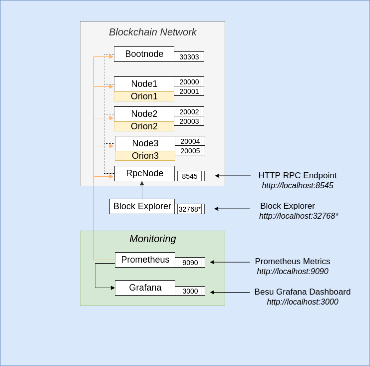
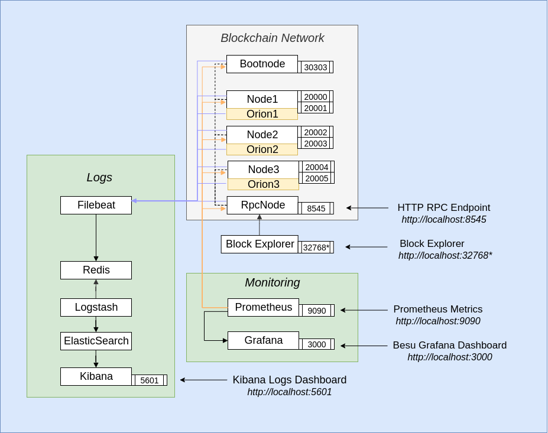

# Quickstart

## Prerequisites

To run these tutorials, you must have the following installed:

- [Docker and Docker-compose](https://docs.docker.com/compose/install/)

| ⚠️ **Note**: If on MacOS or Windows, please ensure that you allow docker to use upto 4G of memory or 6G if running Privacy examples under the _Resources_ section. The [Docker for Mac](https://docs.docker.com/docker-for-mac/) and [Docker Desktop](https://docs.docker.com/docker-for-windows/) sites have details on how to do this at the "Resources" heading |
| ⚠️ **Note**: This has only been tested on Windows 10 Build 18362 and Docker >= 17.12.2                                                                                                                                                                                                                                                                                              |
| ---                                                                                                                                                                                                                                                                                                                                                                                |

- On Windows ensure that the drive that this repo is cloned onto is a "Shared Drive" with Docker Desktop
- On Windows we recommend running all commands from GitBash
- [Nodejs](https://nodejs.org/en/download/) and [Truffle](https://www.trufflesuite.com/truffle) if using the DAp

## Description

There are multiple examples in this repo, and each has a POW and POA example. You can choose the default setup which comprises a 4 node network with the Block Explorer and our Prometheus & Grafana dashboard to track the progress of the chain; or the whole setup with logging via ELK.   
Please use the following use cases personas as guidelines only: 

All our quickstart documentation can be found on the [Besu documentation site](https://besu.hyperledger.org/Tutorials/Quickstarts/Private-Network-Quickstart/).

All the architecture diagrams below generally use the POA (IBFT2) setup, to view the architecture diagrams for the POW (ethash) setup please see the `images` folder, where the files share the same name but have different suffixes. 

### Start Services and Network
`./run.sh` starts all the docker containers

#### Basic 4 Node Network with Block Explorer and Prometheus & Grafana to track the progress of your chain

Use this scenario:
 - if you are a DApp Developer looking for a robust, simple network to use as an experimental testing ground for POCs 
 

#### Use our sample smart contract and DApp (with Metamask) with any of the examples below.
- Install [metamask](https://metamask.io/) as an extension in your browser
- Once you have setup your own private account, select 'My Accounts' by clicking on the avatar pic and then 'Import Account' and enter the following private_key: `0xc87509a1c067bbde78beb793e6fa76530b6382a4c0241e5e4a9ec0a0f44dc0d3`
- Run `./run-dapp.sh` and when that completes open a new tab in your browser and go to `http://localhost:3001` which opens the Truffle pet-shop box app and you can adopt a pet from there.
NOTE: Once you have adopted a pet, you can also go to the block explorer and search for the transaction where you can see its details recorded. Metamask will also have a record of any transactions.

Behind the scenes, this has used a smart contract that is compiled and then deployed (via a migration) to our test network. The source code for the smart contract and the DApp can be found in the folder `pet-shop`

#### Basic 4 Node Network with Block Explorer, Prometheus & Grafana and logs via ELK
This is the same as the previous example but also has ELK in it for the logs
Use this scenario:
- if you are a DevOps engineer or administrator looking to see how the full blockchain works with logging and metrics
- if you are a DApp developer and looking to build on the previous example with the ability to see transaction logs via ELK 

#### Basic 4 Node Network with Privacy (Orion) node sets, the Block Explorer and Prometheus & Grafana 
Use this scenario:
- if you are a user looking to execute private transactions at least one other party

 
`./run-privacy.sh` creates docker images for configuring a network of
Besu nodes as well as Orion nodes which include 3 nodes with privacy
enabled.
Where the node details are as follows:

Name  | Besu Node address                      | Orion node key | Node URL
----- | ---- | ---- | ---- |
node1 | 0x866b0df7138daf807300ed9204de733c1eb6d600 | 9QHwUJ6uK+FuQMzFSXIo7wOLCGFZa0PiF771OLX5c1o= | http://localhost:20000
node2 | 0xa46f0935de4176ffeccdeecaf3c6e3ca03e31b22 | qVDsbJh2UluZOePxbXAL49g0S0s2gGlJ3ftQceMlchU= | http://localhost:20002
node3 | 0x998c8bc11c28b667e4b1930c3fe3c9ab1cde3c52 | T1ItOQxwgY1pTW6YXb2EbKXYkK4saBEys3CfJ2OIKHs= | http://localhost:20004

###### Use `eeajs` to deploy contracts
###### Prerequisites
 - [Nodejs](https://nodejs.org/en/download/)

 Install the following after downloading `Nodejs` -
 - [web3](https://www.npmjs.com/package/web3)
 - [axios](https://www.npmjs.com/package/axios)

 Clone [eeajs](https://github.com/PegaSysEng/web3js-eea) github repo.

###### EventEmitter contract

After the containers from above have started, execute `node example/eventEmitter.js` in the `web3js-eea` project that you have just cloned
This deploys the `EventEmitter` contract, sets a value of `1000` and gets the value.

It can be verified from the output of the last transaction - `0x00000000000000000000000000000000000000000000000000000000000003e8`
which is the hex value of `1000`.

###### ERC20 token

Executing `node example/erc20.js` deploys a `HumanStandardToken` contract and transfers 1 token to node2.

This can be verified from the `data` field of the `logs` which is `1`.
 

 
#### Basic 4 Node Network with Privacy (Orion) node sets, the Block Explorer, Prometheus & Grafana and logs via ELK 
This is the same as the previous example but also has ELK in it for the logs
Use this scenario:
- if you are a user looking to execute private transactions at least one other party
- if you are a developer and looking to build on the previous example with the ability to see transaction logs via ELK 

### Stop Services and Network
`./stop.sh` stops all the docker containers created.

### Remove stopped containers and volumes
`./remove.sh` stops and removes all the containers and volumes.
